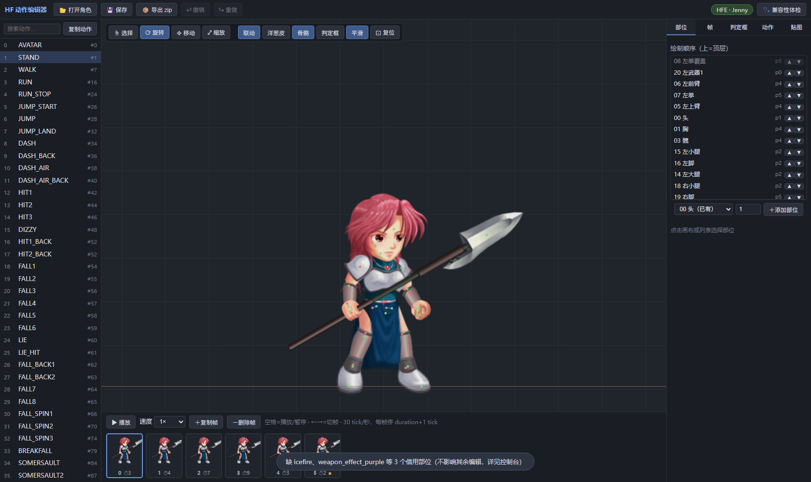
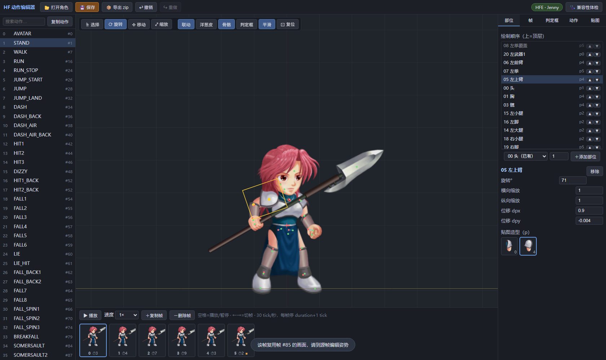
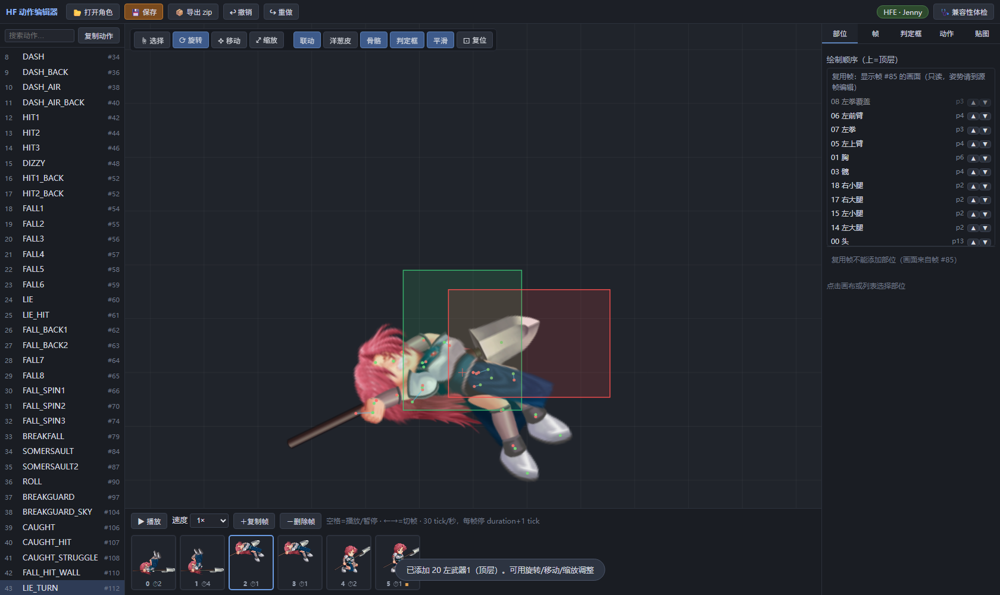
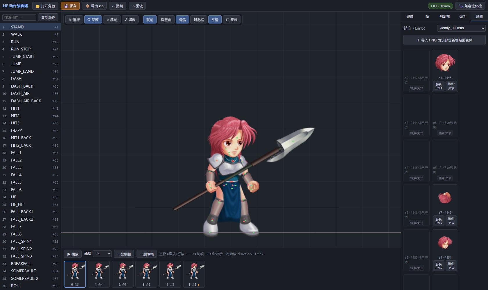

# HF Action Editor

[中文](README.md) | [日本語](README.ja.md)

Hero Fighter / HF-EX 向けのローカルブラウザー型アクション・テクスチャ編集ツールです。HFWorkshop から出力した `Spt.json` / `Lmi` データを手作業で編集する代わりに、アクションフレーム、テクスチャバリエーション、当たり判定を視覚的に編集し、HFWorkshop に取り込める zip を出力できます。

## 主な機能

- HFE v1.0.2 および HF-EX v0.2.5 から出力したキャラクターデータに対応。
- ローカルブラウザーで動作。ビルドや CDN は不要で、`index.html` をダブルクリックするだけで開けます。
- リアルタイム Canvas プレビュー: 描画順、ボーンポイント、地面線、オニオンスキン、当たり判定の重ね表示。
- アクションとフレーム: アクション一覧、タイムライン再生、フレームの複製・削除、アクションの複製。
- ポーズ編集: 選択、回転、移動、拡大縮小。FK 連動の切り替えに対応。
- パーツ管理: 現在のフレームで未使用のパーツの追加、既使用パーツの重複追加、パーツ項目の削除。
- 当たり判定: `editBody` / `editAttack` / `editAttackB` を視覚的に編集し、ランタイム用の判定枠を再生成。
- テクスチャツール: バリエーションの閲覧、PNG の置換、LimbPic バリエーションの追加、アンカー・関節エディター。
- 複数 Lmi 対応: 選択したディレクトリ内にある複数の `*Lmi` フォルダーを自動で読み込み、キャラクター間で共有されるパーツにも対応。
- zip 出力: Spt zip と、各 Lmi フォルダーに対応する zip を生成。

## 画面プレビュー

| アクションタイムラインとキャラクタープレビュー | ポーズ編集 |
|---|---|
|  |  |
| 当たり判定の可視化 | テクスチャバリエーション |
|  |  |

## ディレクトリ構成

```text
HF Action Editor/
├─ index.html              # エントリーページ
├─ css/app.css             # UI スタイル
├─ docs/screenshots/       # README 用スクリーンショット
├─ js/
│  ├─ app.js               # メインコントローラー、状態、保存、編集の入口
│  ├─ model.js             # Spt/Lmi データモデル、複数 Lmi、変更ファイルの追跡
│  ├─ jsonio.js            # HFWorkshop JSON のキー順・数値表現を保つ解析とシリアライズ
│  ├─ as3math.js           # AS3 Matrix の再現、行列の構築・分解
│  ├─ skeleton.js          # ボーンの静的テーブル、既定の描画順、パーツ名
│  ├─ pose.js              # フレームポーズ、FK/非連動の再構築、ref 再利用フレーム
│  ├─ render.js            # Canvas 描画とヒットテスト
│  ├─ rebake.js            # クリッピング枠、footY、行列、判定枠の再ベイク
│  ├─ fsio.js              # フォルダーの読み込みと書き戻し
│  ├─ zip.js               # zip の生成と出力
│  └─ ui/                  # 各パネル
├─ test/
│  ├─ all.js               # Node テストの総合エントリー
│  ├─ roundtrip.js         # JSON ラウンドトリップテスト
│  ├─ matrix.js            # 行列の回帰テスト
│  └─ browser/e2e.js       # ブラウザー E2E テスト
├─ 使用说明.md             # 中国語の利用者向け操作説明
├─ 进度记录.md             # 実装状況と検証記録
├─ README.md
├─ README.ja.md
├─ CHANGELOG.md
└─ 维护说明.md
```

## 使い方

1. Edge または Chrome で `index.html` を開きます。
2. 「キャラクターを開く」をクリックし、キャラクターの Spt/Lmi 出力フォルダーを含む親ディレクトリを選択します。例:

```text
キャラクターディレクトリ/
├─ 197 - Data.Global_taylorSpt/
│  └─ Spt.json
├─ 465 - Data.Global_taylorLmi/
│  ├─ Limb_*.json
│  ├─ LimbPic_*.json
│  └─ *.png
└─ 共有パーツを含む追加の *Lmi/   # 任意。ツールが同階層の Lmi をすべて読み込みます
```

3. アクション、フレーム、パーツ、当たり判定、またはテクスチャを編集します。
4. 「保存」で元のフォルダーへ書き戻すか、「zip を出力」で HFWorkshop に取り込める zip を生成します。

### 複数 Lmi / パーツ不足について

Hero Fighter の Limb はグローバルに登録されます。キャラクターが別キャラクターのパーツや共有エフェクトの Lmi を参照することがあります。たとえば Taylor が Lucas の拳を借用したり、Rudolf が `rudolf_*` パーツを含む別の Lmi を参照したりします。

ツールに「パーツ不足」の警告が出た場合:

1. 警告に表示された Limb 名を控えます。例: `Lucas_07LeftFist`。
2. HFWorkshop で、その Limb を含む `* - Data.Global_*Lmi` を探して出力します。
3. 解凍した Lmi フォルダーを、現在のキャラクターディレクトリの隣に置きます。
4. キャラクターを開き直します。

ツールは同じディレクトリ内にあるすべての `*Lmi` フォルダーを読み込み、それぞれの画像プールを独立して解析します。

## 開発とテスト

### Node データ層と行列テスト

```bash
cd <repo>
node test/all.js
```

以下を実行します:

- `test/roundtrip.js`: HFE/HFEX のサンプル JSON を読み込んで書き戻しても、バイト単位で一致することを確認。
- `test/matrix.js`: すべてのフレームパーツで、行列の分解と再構築の誤差が `1e-6` 未満であることを確認。

### ブラウザー E2E テスト

初回のみ依存関係をインストールします。`puppeteer-core` を使用するため、ブラウザーはダウンロードしません。

```bash
cd <repo>/test/browser
npm install
```

テストを実行します:

```bash
cd <repo>
node test/browser/e2e.js
```

テストはシステムの Edge を操作し、読み込み、描画、再生、FK、非連動、パーツの追加・削除、当たり判定、テクスチャ、zip、複数 Lmi などの主要フローを確認します。

## Git 運用の注意

このリポジトリではソース、テスト、ドキュメントのみを追跡します。次の内容は `.gitignore` で除外されています:

- `node_modules/`
- `test/browser/downloads/`
- `test/browser/shots/`
- 手動で出力した `*.zip`
- 一時ログとエディター状態

機能を変更した後は、次を実行することを推奨します:

```bash
node test/all.js
node test/browser/e2e.js
```

エクスポート、footY、ボーン、当たり判定、複数 Lmi に関わる変更では、ゲーム内での実機確認も必要です。
